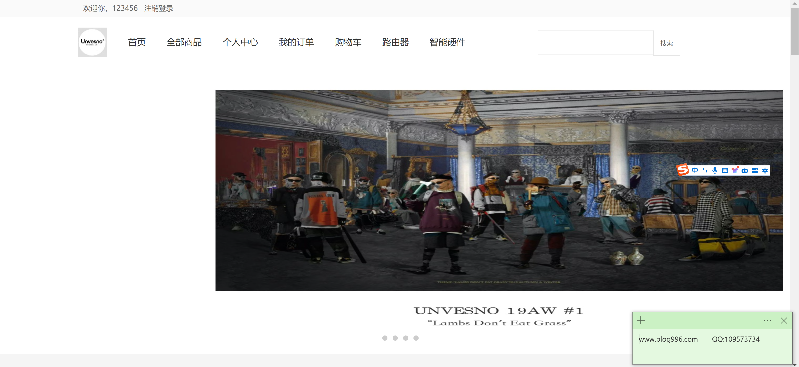
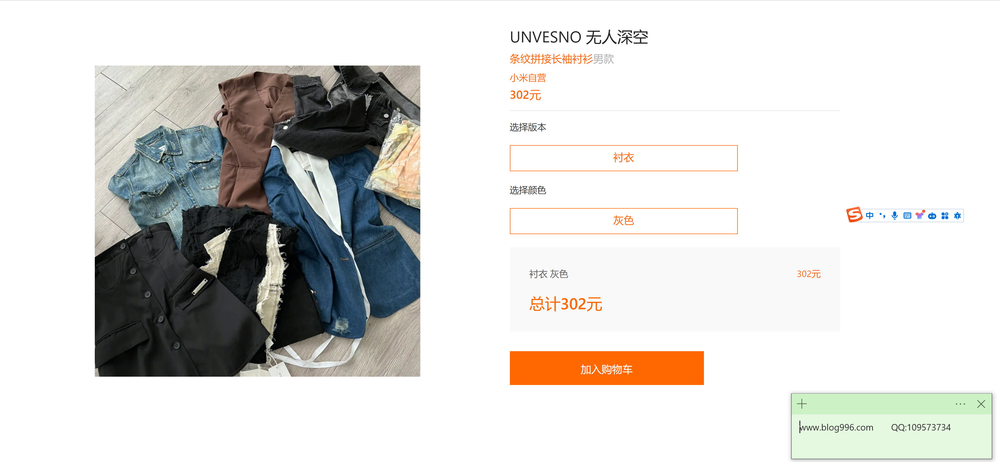
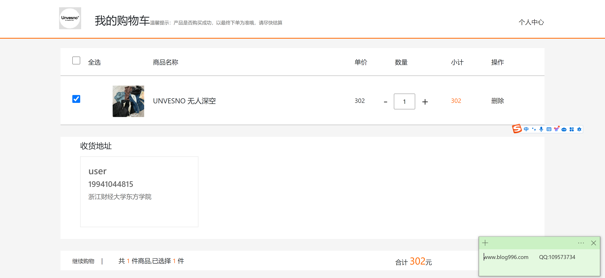
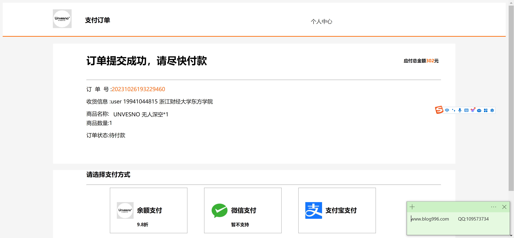
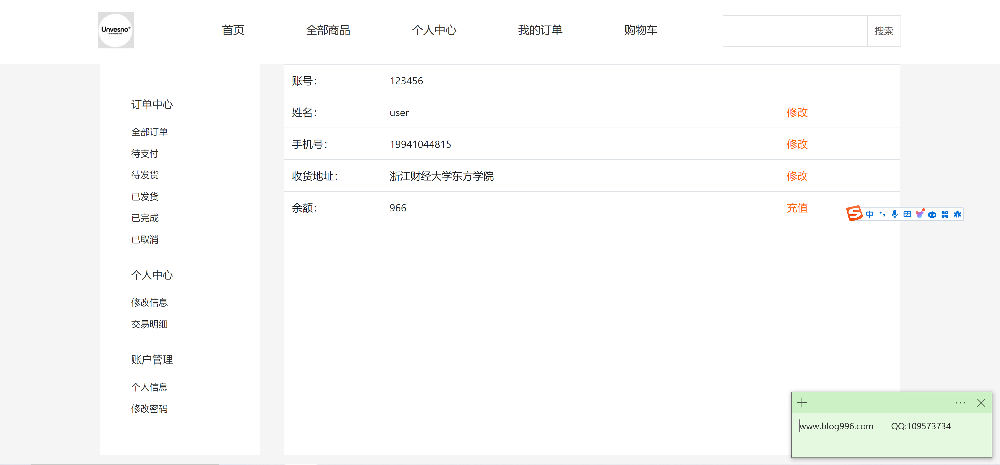
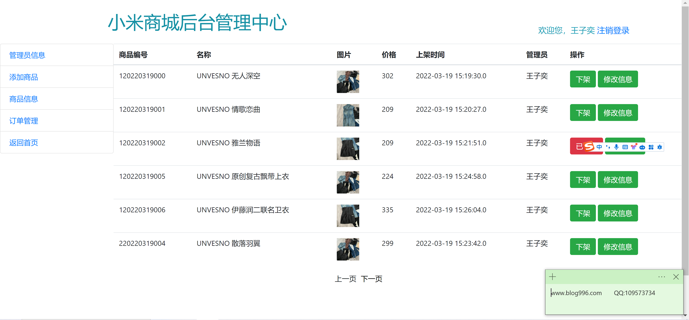
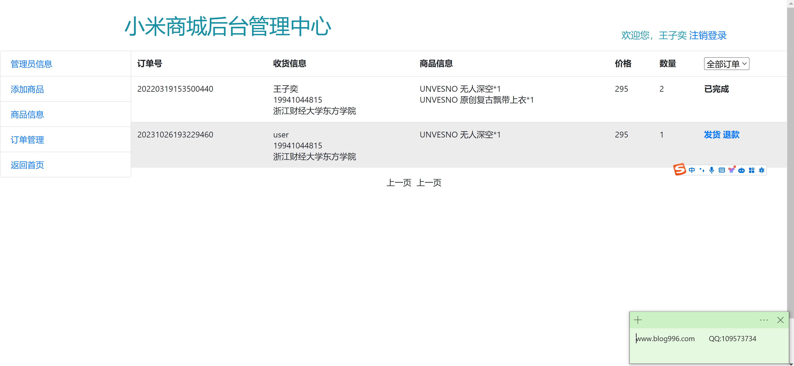

<h1 align="center">小米商城管理系统</h1>

## 简介
小米商城管理系统：角色分为管理员、用户；包含商品管理、订单管理、用户管理、数据统计等功能，支持商品编辑、订单处理、账户管理和数据分析，提升用户体验和管理效率。    --计算机毕业设计源码；毕设源码；java毕业设计源码

## 联系方式

<h3 align="center">获取完整代码与数据库文件 + 微信：bysj5151 QQ: 86050149 QQ群: 783742310</h3>

<h3 align="center">可帮忙远程部署 包运行成功！提供远程部署、修改代码、设计文档指导、代码讲解等服务！</h3>

## 功能介绍（完整见运行截图）
管理员：管理员可以通过后台管理中心登录系统，管理商品、订单和用户信息。商品管理包括商品的添加、编辑、删除和上下架操作，订单管理用于查看和处理订单，用户管理允许管理员更新用户账户和权限。数据统计功能提供销售数据的可视化分析，帮助管理员制定决策。

用户：用户可以在小米商城注册登录，浏览商品并将商品加入购物车。购物页面让用户选择商品版本、颜色等选项，并通过简洁明了的界面进行结算和在线支付。个人中心包括订单管理、地址管理和账户信息查看与更新，允许用户有效地管理个人信息和订单。用户可以查看购物车商品详情，调整数量或删除商品，并通过多种支付方式完成交易。

## 运行截图

本代码来源于网络,仅供学习参考使用!

